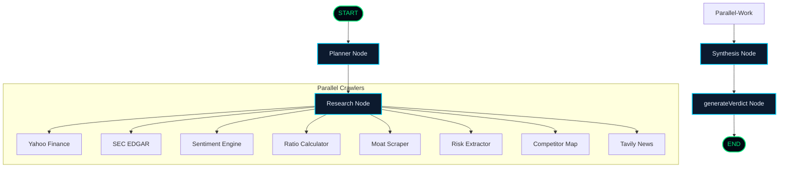

# 🛠️ System Architecture Design — Verity AI Research Agent

This document outlines the detailed system architecture, backend graph routing, data contracts, and streaming protocols implemented in **Verity AI**.

---

## 01. Graph Orchestration Architecture

We utilize **LangGraph.js** to construct a deterministic StateGraph that coordinates our multi-agent reasoning flow. By defining structured state schemas and specific node boundaries, we prevent LLM "drift" and ensure strict, auditable execution.



### The 4 Reasoning Nodes

1.  **Planner Node (`planner`)**:
    - **Model**: `llama-3.1-8b-instant` (Optimized for quick extraction and speed).
    - **Action**: Resolves the generic company query into an official ticker and stock exchange. Generates 3–5 targeted research questions to guide the crawlers.
2.  **Research Node (`research`)**:
    - **Action**: Concurrently spins up 8 specialized financial and text-crawling tools using JavaScript `Promise.allSettled()`. Evaluates all crawlers independently to ensure that if a single API rate limit is hit, the rest of the crawlers complete successfully (graceful degradation).
3.  **Synthesis Node (`synthesis`)**:
    - **Model**: `llama-3.3-70b-versatile` (Optimized for deep synthesis and long context).
    - **Action**: Aggregates the unstructured text files (SEC files, news articles) and structured numerical values. Grades the target across 7 factors (Fundamentals, Growth, Valuation, Moat, Sentiment, Risk, Management) and writes explicit justifications for each.
4.  **Verdict Node (`generateVerdict`)**:
    - **Model**: `llama-3.3-70b-versatile` (Deep logic and accuracy).
    - **Action**: Coordinates a simulated 5-member investment board (e.g. Growth Investor, Skeptic Risk Officer, Value Fundamentalist). Casts votes, generates recommended portfolio weights, highlights key risks, and outputs the final recommendation.

---

## 02. Server-Sent Events (SSE) Protocol

To create a responsive, real-time interface, the backend streams the agent's progress continuously over a single HTTP connection. 

### API Endpoint
`GET /api/analyze?company=<name>`

### Event Payload Definitions

#### 1. `plan_ready`
Fires when the Planner resolves the stock ticker and schedules search targets.
*   **Payload Schema**:
    ```json
    {
      "company": "Apple",
      "ticker": "AAPL",
      "plan": [
        "What is the revenue growth rate?",
        "Are Services margins expanding?"
      ]
    }
    ```

#### 2. `tool_result`
Fires individually as each of the 8 parallel crawlers completes, sending raw tool payloads to the client.
*   **Payload Schema**:
    ```json
    {
      "tool": "yahooFinance",
      "status": "success",
      "data": {
        "price": 214.30,
        "currency": "USD",
        "pe": 31.8,
        "revenueGrowth": 0.052
      }
    }
    ```

#### 3. `synthesis_done`
Fires when the Synthesis node finishes scoring the 7 parameters and compiling risk logs.
*   **Payload Schema**:
    ```json
    {
      "evidence": {
        "scores": {
          "fundamentals": { "value": 89, "reason": "Consistent double-digit margins..." },
          "growth": { "value": 68, "reason": "Slowing iPhone sales offset by services..." }
        },
        "risks": [
          { "title": "Hardware Saturation", "severity": "MEDIUM", "description": "Extended upgrade cycles..." }
        ],
        "news": [
          { "headline": "Apple Intelligence Launches", "source": "Bloomberg", "tone": "positive" }
        ],
        "newsSynthesis": {
          "summary": "Overall market sentiment is positive...",
          "positive": ["AI features driving stock rally"],
          "negative": ["Regulatory pressure in Europe"]
        },
        "keyMetrics": {
          "Price": "$214.30",
          "P/E Ratio": "31.8"
        }
      }
    }
    ```

#### 4. `verdict_final`
Fires when the verdict committee completes voting and issues the portfolio configuration.
*   **Payload Schema**:
    ```json
    {
      "verdict": {
        "decision": "INVEST",
        "score": 82,
        "rationale": "Strong balance sheet combined with high margins and moat...",
        "keyWhy": ["Ecosystem lock-in", "High services profitability"],
        "keyRisks": ["Antitrust regulation", "High valuation multiples"],
        "positionSizing": "5.0% allocation",
        "committeeVotes": {
          "Growth Agent": "INVEST",
          "Value Agent": "HOLD",
          "News Agent": "INVEST",
          "Risk Agent": "HOLD",
          "Final Verdict": "INVEST"
        }
      }
    }
    ```

#### 5. `done`
Fires when the connection is ready to close.
*   **Payload Schema**:
    ```json
    { "message": "Analysis complete" }
    ```

#### 6. `error`
Fires if any critical compilation or API error halts the graph.
*   **Payload Schema**:
    ```json
    { "message": "Failed to connect to LLM provider." }
    ```

---

## 03. Parallel Crawling Concurrency Map

The Research node runs crawlers concurrently in the Node.js event loop:

```typescript
const results = await Promise.allSettled([
  yahooFinanceCrawler(ticker),
  secEdgarCrawler(ticker),
  newsCrawler(company),
  macroCrawler(),
  finnhubCrawler(ticker),
  ...
]);
```

Each crawler returns structured data, which is formatted and immediately streamed to the frontend via SSE before the graph transitions to the Synthesis node.

---

## 04. Client-Side State Machine

The client hooks into the stream using the browser's native `EventSource` interface. A unified state machine processes events step-by-step:

```typescript
const eventSource = new EventSource(`/api/analyze?company=${company}`);

eventSource.addEventListener("plan_ready", (e) => {
  const data = JSON.parse(e.data);
  dispatch({ type: "SET_PLAN", payload: data });
});

eventSource.addEventListener("tool_result", (e) => {
  const data = JSON.parse(e.data);
  dispatch({ type: "ADD_TOOL_LOG", payload: data });
});

eventSource.addEventListener("synthesis_done", (e) => {
  const data = JSON.parse(e.data);
  dispatch({ type: "SET_SYNTHESIS", payload: data.evidence });
});

eventSource.addEventListener("verdict_final", (e) => {
  const data = JSON.parse(e.data);
  dispatch({ type: "SET_VERDICT", payload: data.verdict });
});
```

This guarantees an immediate, progressive rendering path, allowing the user to inspect data as it crawls without waiting for the full 60-second analysis to complete.
